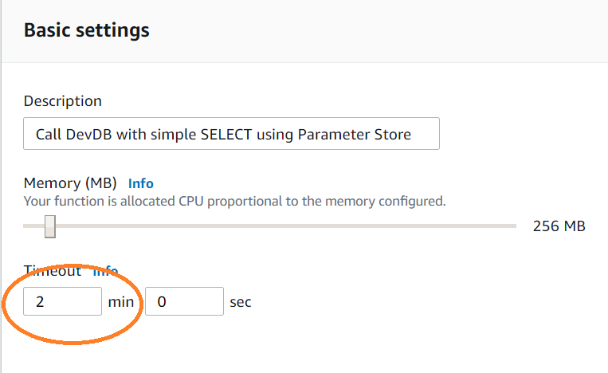

# Parameter Store workshop


## Workshop progress

✅[Lab 1: Add your secrets to Parameter Store](../lab1)

✅[Lab 2: Create an Aurora Serverless MySQL cluster](../lab2)

**Lab 3: Access Parameters from your code**

## Lab 3: Access Parameters from your code

Applications must not include credentials in their code.  When one hard-wires credentials, there is a strong risk of compromise.  Default credentials are vulnerable to reverse engineering attacks or attacks based on access to the source code.

Password Vaults, such as Parameter Store, provide secure, reliable access to credentials, without the need for vulnerable configuration files or hard-wired credentials.

### 1. Modify Lambda Function to point at our parameter

In this lab, we will look at a Lambda function which uses our credentials to access the data you just added to the database.

<details>
Here is a snippet of the code, which talks to Parameter Store:

```

# Is this the Prod or Dev Environment?
environment = os.environ.get('Environment')
# Where is the root, in Parameter store
parameterRoot = os.environ.get('ParamRoot') + "/" + environment
# Get the login from parameter store
try:
   # Get the login from parameter store
   param = parameterRoot + "/Login"
   login = ps.get_parameter(Name=param)['Parameter']['Value']
   # Get the password from parameter store
   param = parameterRoot + "/Password"
   password = ps.get_parameter(Name=param)['Parameter']['Value']
except:
  ...

```

Notice that we are getting some details from the O/S environment, including where in the parameter store to find our information, and whether this is Prod or Dev.  We then use this information to retrieve the sensitive information from Parameter Store.

In this lab, we will set the environment variables, so that lambda can find the parameters.  We will then verify that the Lambda function can access the database with these credentials.

</details>

Open [Lambda](https://console.aws.amazon.com/lambda/home?region=us-east-1#/functions) in the AWS console.  Click on the hyperlink for our function, ps-rds-rds-ps.

<div align="center">

.

</div>


### 2. Edit the template parameter named “ParameterRoot”.  **Set the default value to the root of your parameter store _/mydb_**.


Scroll down, about 2/3 of the way down the page to the Environment variables section.

<div align="center">


</div>

**Update the ParamRoot to the base of our parameters ( /mydb ).**

### 3. Change the Timeout in "Basic Settings" to 2 minutes
   
   A little further down the configuration page for Lambda is a section labeled "Basic settings".  Change the Lambda Timeout to 2 minutes and click Save [ near the top of the screen ].

</div>


<div align="center">




</div>   

### 4. To test that this worked, return to the Cloud9 CLI.

<pre>

cd ~/environment/parameter-store/lab3
chmod +x trigger-lambda.bash
./trigger-lambda.bash

</pre>

You called the lambda function via the AWS CLI.  The resulting output should be your database content, similar to:

```
Calling your lambda function ps-rds-rds-ps
{
    "ExecutedVersion": "$LATEST", 
    "StatusCode": 200
}
{"body": [[1, "Jane", "Smith", "1 South Main", "Springfield", "OH", "43215"], [2, "John", "Smith", "1 South Main", "Springfield", "IL", "43215"], [3, "Amy", "Simpson", "11 South Main", "Springfield", "MO", "43215"], [4, "Jack", "Frank", "12 South Main", "Springfield", "TX", "43215"]], "StatusCode": 202}

```

## Summary

This completes our lab.  In this lab, you:
1.	Added parameters to AWS Systems Manager Parameter store
2.	Used CloudFormation to create a database with these credentials
3.	Added content to the database, using these credentials
4.	And finally, accessed the database from a Lambda function

You did this all, with no _secrets_ coded into the CloudFormation template, CLI command, or Lambda function.

Credential and configuration vaults, like AWS Parameter Store, AWS Secrets Manager, and Hashicorp Vault are an important tool to keeping our applications secure and manageable.  Avoid hard-coding secrets into a file or shell script, there is too much danger of them leaking, and enabling unauthorized access, loss of intellectual property, or worse.


## Participation

We encourage participation; if you find anything, please submit an [issue](https://github.com/dotstar/parameter-store/issues). However, if you want to help raise the bar, submit a [PR](https://github.com/dotstar/parameter-store/pulls)!

<!--## License

This library is licensed under the Apache 2.0 License.
-->
